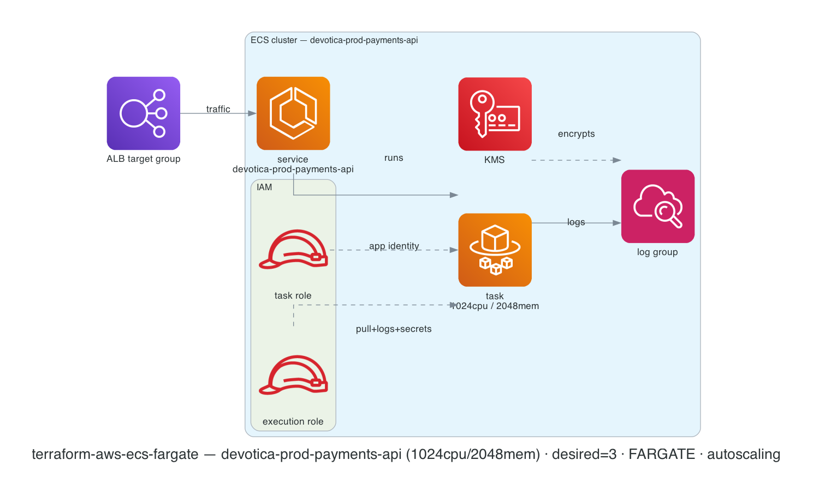

# terraform-aws-ecs-fargate

[](https://github.com/devotica-labs/terraform-aws-ecs-fargate/actions/workflows/ci.yml)
[](https://github.com/devotica-labs/terraform-aws-ecs-fargate/actions/workflows/release.yml)
[](LICENSE)

Production-grade AWS ECS **Fargate** service module — the application-compute layer that ties the Devotica catalog together. Runs a single-container service on Fargate in private subnets, optionally behind an ALB target group, with KMS-encrypted logs, inline IAM roles, and target-tracking autoscaling.

This module follows the Devotica module shape: Apache-2.0 licensed, validated inputs, plan-only unit + contract tests (mock-provider), terraform-docs auto-update, central reusable CI from `devotica-labs/terraform-shared-config`, and signed releases with CycloneDX SBOMs.

<!-- BEGIN_ARCH -->



<sub>Generated by `.github/workflows/architecture-diagram.yml` on every push to main. Do not edit the image by hand — change the Terraform code in `examples/complete/` and the bot will regenerate it.</sub>

<!-- END_ARCH -->

## Scope

| Surface | Covered |
|---|---|
| ECS cluster (create or bring-your-own) | ✅ |
| Single-container Fargate task definition (awsvpc, ARM64) | ✅ |
| Plain env vars + Secrets Manager / SSM secrets | ✅ |
| Inline execution + task IAM roles (override with ARNs) | ✅ |
| KMS-encryptable CloudWatch log group | ✅ |
| Auto-created service security group (or BYO) | ✅ |
| ALB target-group attachment | ✅ (optional) |
| Target-tracking autoscaling (CPU and/or memory) | ✅ (optional) |
| FARGATE_SPOT | ✅ (opt-in) |
| ECS Exec | ✅ (opt-in, off by default) |
| Read-only root filesystem | ✅ (default on) |
| Sidecar / multi-container task defs | ❌ (planned) |
| Cloud Map service discovery | ❌ (planned) |
| EFS volume mounts | ❌ (planned) |
| Blue/green via CodeDeploy | ❌ (out of scope) |
| EC2 launch type | ❌ (Fargate-only by design) |

## Quick start

```hcl
module "ecs" {
  source  = "devotica-labs/ecs-fargate/aws"
  version = "~> 0.1"

  name       = "my-app"
  vpc_id     = module.vpc.vpc_id
  subnet_ids = module.vpc.private_subnet_ids

  ingress_security_group_ids = [module.alb.alb_security_group_id]

  container_image = "111122223333.dkr.ecr.ap-south-1.amazonaws.com/my-app:1.0.0"
  container_port  = 8080

  alb_target_group_arn = module.alb.target_group_arns["api"]
  log_kms_key_arn      = module.kms.key_arn

  tags = {
    Environment = "production"
    Project     = "my-app"
    Owner       = "platform@example.com"
    CostCenter  = "PLATFORM"
    ManagedBy   = "Terraform"
    Repo        = "https://github.com/your-org/your-infra"
  }
}
```

See [`examples/complete`](examples/complete/main.tf) for the full surface (ECR image, secrets, ALB attach, KMS-encrypted logs, CPU+memory autoscaling).

## Defaults that matter

- **`assign_public_ip = false`** — tasks live in private subnets; inbound comes via the ALB, outbound via NAT.
- **`enable_execute_command = false`** — ECS Exec is an interactive shell into running tasks; enable deliberately and audit via CloudTrail.
- **`readonly_root_filesystem = true`** — defence in depth (CKV_AWS_336). Use a writable volume for apps that need scratch space.
- **Container Insights on** for created clusters.
- **ARM64 / Graviton** runtime — cheaper and lower-carbon. Your image must be built for `linux/arm64`.
- **`desired_count = 2`** for HA across AZs.
- **Service security group** admits only the configured source SGs (e.g. the ALB SG) on the container port — never `0.0.0.0/0`.
- **Tags**: every taggable resource gets `ManagedBy = "terraform"` and `Module = "terraform-aws-ecs-fargate"` merged with `var.tags`.

## How this fits the Devotica catalog

```
terraform-aws-vpc          terraform-aws-alb          terraform-aws-kms
   │ private subnets          │ target group +            │ log + secret
   │ + vpc_id                 │ ALB security group        │ encryption key
   ▼                          ▼                           ▼
                       terraform-aws-ecs-fargate
                                │ service security group
                                ▼
                       terraform-aws-rds  (allow ingress from the ECS SG;
                                           grant the task role DB access)
```

Typical wiring in a `sample-infra`-style consumer:

```hcl
module "ecs" {
  source = "devotica-labs/ecs-fargate/aws"

  name       = "payments-api"
  vpc_id     = data.terraform_remote_state.vpc.outputs.vpc_id
  subnet_ids = data.terraform_remote_state.vpc.outputs.private_subnet_ids

  ingress_security_group_ids = [data.terraform_remote_state.alb.outputs.alb_security_group_id]
  alb_target_group_arn       = data.terraform_remote_state.alb.outputs.target_group_arns["api"]
  log_kms_key_arn            = data.terraform_remote_state.kms.outputs.key_arn

  container_image = "...ecr.../payments-api:1.4.2"
  container_port  = 8080

  additional_task_role_policy_arns = [aws_iam_policy.payments_app.arn]
}

# Let the DB accept connections from the service:
resource "aws_vpc_security_group_ingress_rule" "db_from_ecs" {
  security_group_id            = data.terraform_remote_state.rds.outputs.db_security_group_id
  referenced_security_group_id = module.ecs.security_group_id
  ip_protocol                  = "tcp"
  from_port                    = 5432
  to_port                      = 5432
}
```

## Secrets

`var.secrets` is a `name → ARN` map (Secrets Manager secret or SSM SecureString). The module injects them into the container via the ECS `secrets` block and grants the **execution** role `secretsmanager:GetSecretValue` / `ssm:GetParameters` on exactly those ARNs (plus `kms:Decrypt` on `log_kms_key_arn` when set). Secret *values* never appear in the task definition or state in plaintext.

## Governance

- CI runs the central reusable workflow from `devotica-labs/terraform-shared-config`: fmt, validate, tflint, tfsec, gitleaks, terraform-docs, conftest against `devotica-labs/terraform-policies`, terraform test, checkov, examples build.
- Releases are cut by `release-please` on Conventional Commits. Each release is keyless-signed via cosign and ships a CycloneDX SBOM.
- Dependabot PRs auto-approve + auto-merge once CI is green.

<!-- BEGIN_TF_DOCS -->
<!-- terraform-docs will inject the inputs/outputs/resources tables here on the next CI run -->
<!-- END_TF_DOCS -->

## License

Apache-2.0. See [`LICENSE`](LICENSE) and [`NOTICE`](NOTICE).
